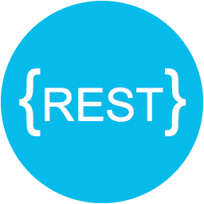

# API Rest com Nodejs

<p align="center">
       
</p>

<!--  -->


<!--A atividade consiste na criação de uma API NODE utilizando o padrão REST, com banco RELACIONAL e que faça o controle de uma "lista de tarefas", onde será necessário criar uma "Tarefa" contendo a "descrição", a "data de criação" e um "status" que pode variar entre "pendente", "andamento" e "concluida". Deverá ser possível realizar um CRUD com as tarefas registradas na lista.-->

<b>Projeto de uma API NodeJs com boas práticas REST, banco de dados SQL e ORM Sequelize.</b>

## Programas

Node Js, [link](https://nodejs.org/en/download/package-manager/) para o tutorial de instalação (Windows/Mac/Linux).

PostgreSQL, [link](https://www.postgresqltutorial.com/install-postgresql/) para o tutorial de instalação (Windows/Mac/Linux).

Insomnia REST Client, [link](https://www.postgresqltutorial.com/install-postgresql/) para o tutorial de instalação (Windows/Mac/Linux), ou execute a seguinte linha de comando:
```bash
choco install insomnia-rest-api-client
```

## Instalação
```bash
npm install
```

## Licença
[MIT](https://choosealicense.com/licenses/mit/)
